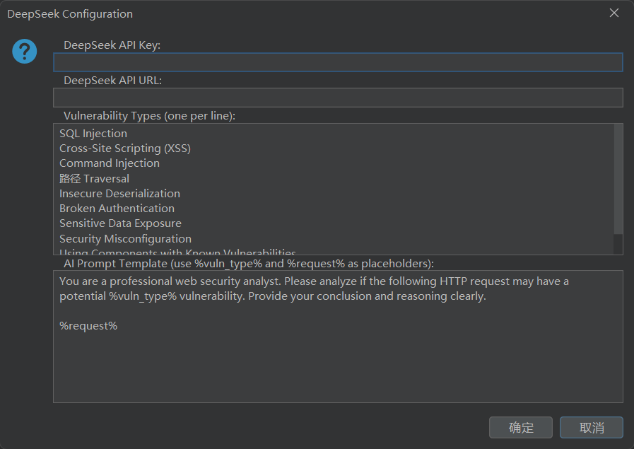
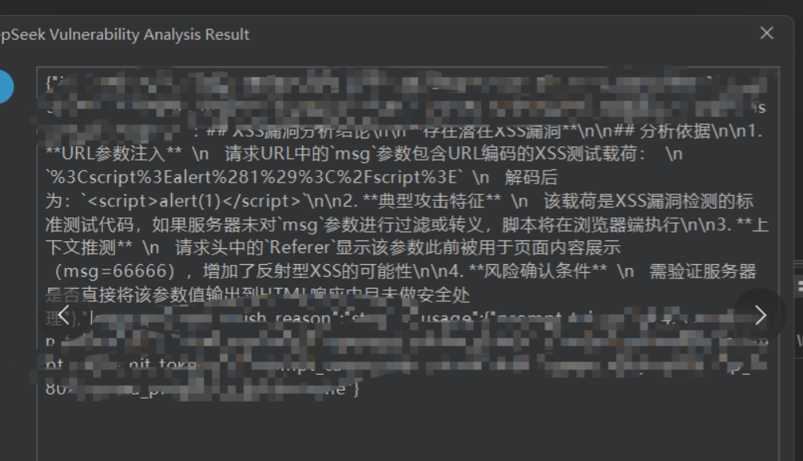
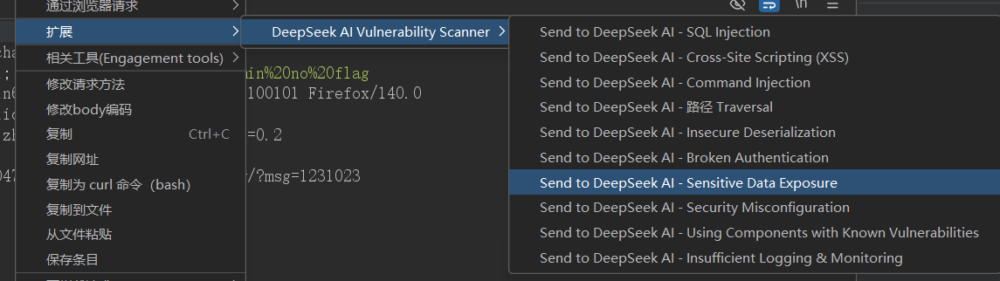

# Burp DeepSeek AI Scanner

A Burp Suite extension that integrates DeepSeek AI to analyze HTTP requests for potential vulnerabilities.

## Features
- Customizable vulnerability types (OWASP Top 10)
- Customizable AI prompt template
- Real-time vulnerability analysis via DeepSeek API

## Usage
1. Load this `.py` script into Burp Suite Extender (Jython required).
2. Configure API Key and API URL when prompted.
3. Right-click any HTTP request in Burp → choose a vulnerability type → AI will analyze it.

## Screenshot

## Requirements
- Burp Suite (Community or Pro)
- Jython 2.7+
- DeepSeek API key
